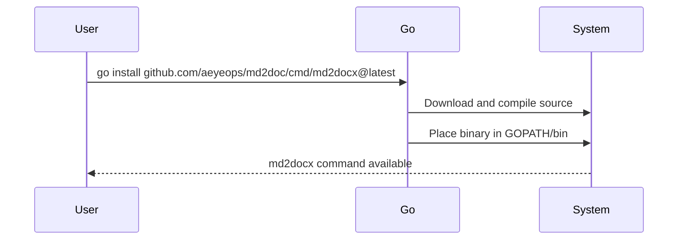

# 📝 md2docx

[](https://github.com/aeyeops/md2doc/actions/workflows/ci.yml)
[](https://github.com/aeyeops/md2doc/actions/workflows/release.yml)
[](LICENSE)

> **From Markdown to Word in seconds** - A lightning-fast CLI converter built in under an hour!

**md2docx** is a powerful command-line tool that converts Markdown files to Microsoft Word `.docx` documents using [Pandoc](https://pandoc.org/). Transform your documentation workflow with a single command or right-click - no Microsoft Office required!

## 🌟 Why md2docx?

This project was born from necessity - created in less than an hour to solve a common problem: converting markdown to Word documents without opening bloated applications or dealing with complex environments. It's the perfect example of how a simple Go utility can save hours of time.

## 🔄 How It Works


## ✨ Features

- 🚀 **Ultra-Fast Conversion** - Markdown to `.docx` with a single command
- 🎨 **Custom Styling** - Use reference `.docx` templates for professional formatting
- 🖱️ **Windows Integration** - Right-click on any `.md` file to instantly convert
- 🔧 **Zero Config** - Works out of the box with minimal dependencies
- 📦 **Cross-Platform** - Pre-built binaries for Windows, macOS, and Linux

## 📋 Requirements

- [Pandoc](https://pandoc.org/installing.html) installed and available in your `PATH`
- [Go](https://golang.org/dl/) (≥ 1.20) only if building from source

## 🔧 Installation

### 1. Using Go install



Ensure you have Go installed (≥1.20) and that your `$GOPATH/bin` (Linux/macOS) or `%USERPROFILE%\go\bin` (Windows) is in your `PATH`, then run:
```bash
go install github.com/aeyeops/md2doc/cmd/md2docx@latest
```

### 2. Build from source

Clone the repository and build locally:
```bash
git clone https://github.com/aeyeops/md2doc.git
cd md2doc
go build -o md2docx ./cmd/md2docx
```
For cross‑compiling to Windows on Linux/macOS:
```bash
GOOS=windows GOARCH=amd64 go build -o md2docx.exe ./cmd/md2docx
```
Copy the resulting binary (`md2docx` or `md2docx.exe`) to a directory in your `PATH`.

### 3. Pre‑built binaries

Download the latest release for your platform from the [GitHub Releases page](https://github.com/AeyeOps/md2doc/releases), extract it, and place the `md2docx` (or `md2docx.exe`) binary into a directory in your `PATH`.

### 4. Homebrew (macOS)

Install via Homebrew from the included formula:
```bash
brew install --build-from-source ./packaging/homebrew/md2docx.rb
```

## 🚀 Usage

Basic usage:
```bash
md2docx [options] input.md
```

Options:
- `-template path` : Path to a reference `.docx` template file (to control styles, margins, and page size)
- `-verbose`       : Enable verbose output

The output file will be created next to the input file with the same base name and a `.docx` extension.

## 📂 Examples

We’ve included an [example Markdown file](examples/sample.md) demonstrating headings, lists, code blocks, and diagrams. To generate the corresponding Word document:
```bash
md2docx examples/sample.md
# This produces examples/sample.docx alongside sample.md
```
Feel free to open the resulting `.docx` in Microsoft Word to inspect the formatting, page size (US Letter), and embedded diagram.

## 📦 Packaging

We provide installers and packages for easy installation via GitHub Releases:
- **Windows**: NSIS installer (`md2docx-<version>-installer.exe`)
- **Debian/Ubuntu**: `.deb` package (`md2docx_<version>_amd64.deb`)
- **macOS**: Tarball (`md2docx_<version>_darwin_amd64.tar.gz`) and Homebrew formula

## 🖱️ Windows Shell Integration


Import the registry file to add a "Generate Word Document" context menu option for Markdown files:
1. Double-click `windows-context-menu.reg` on Windows
2. Confirm the prompt to import into the registry
3. Right-click on a `.md` file and select **Generate Word Document**

See [`windows-context-menu.reg`](windows-context-menu.reg) for details.

## 🔄 CI & Releases

We use GitHub Actions for continuous integration and automated releases:


- **CI**: Builds and tests on push/PR to `main` (Linux/macOS/Windows)
- **Releases**:
  - On pushing a version tag matching `v*.*.*`, the release workflow:
    1. Cross‑compiles Linux, Windows, and macOS binaries
    2. Packages each into ZIP archives
    3. Creates a GitHub Release with auto‑generated release notes
    4. Uploads the ZIP assets to the release
  - You can also manually trigger the release workflow via the **Run workflow** button under the Actions tab

To publish a new release:
```bash
git tag vX.Y.Z
git push origin main --tags
```

## 👨‍💻 Contributing

Contributions are welcome! Please open issues and submit PRs on the GitHub repository.

## 📄 License

This project is licensed under the MIT License. See [LICENSE](LICENSE) for details.