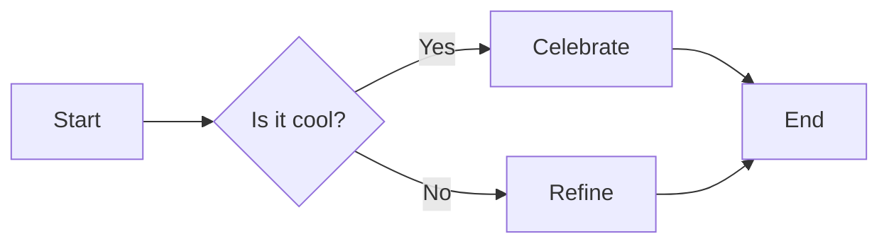

# Sample Document

This is a **sample** Markdown document to demonstrate `md2docx` features.

## Features Demonstrated

- Headings
- Bold and *italic* text
- Lists
- Code blocks
- UML-style diagrams (Mermaid)

### List Example

- First item
- Second item
- Third item

### Code Example

```go
package main

import "fmt"

func main() {
    fmt.Println("Hello, Word!")
}
```

### Diagram Example

